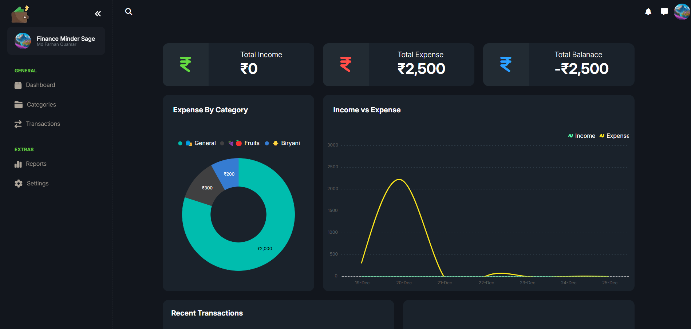
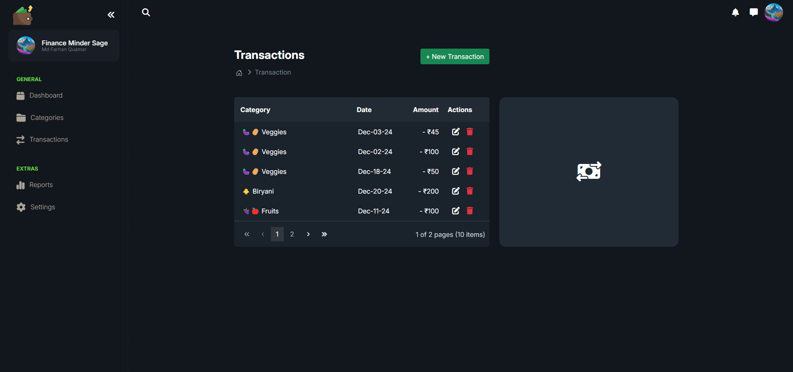
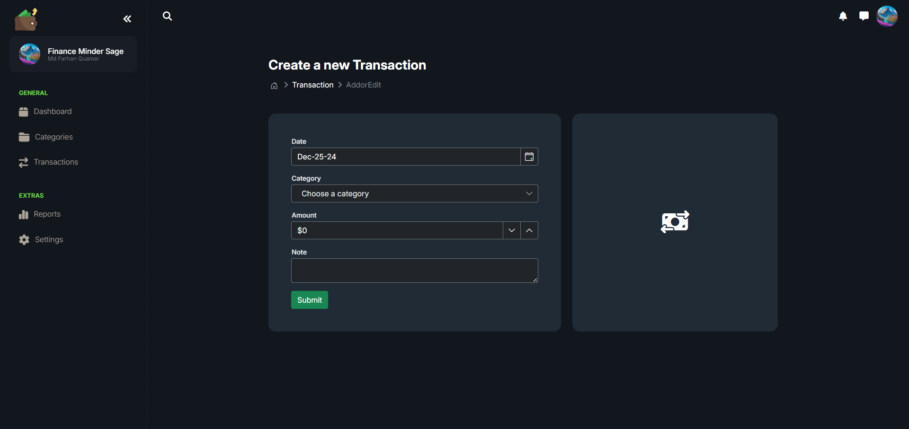

# Expense Tracker - ASP.NET Core MVC Application

## Overview
This project is an **Expense Tracker** application developed using **ASP.NET Core MVC**, **Syncfusion**, **Bootstrap** and **MySQL**. It enables users to manage and track their daily, weekly, and monthly expenses with an intuitive and feature-rich interface. The application focuses on simplicity, usability, and data visualization to help users stay on top of their financial goals.

## Features
- **Expense Management**: Add, edit, and delete expenses easily.
- **Expense Categories**: Categorize expenses for better organization.
- **Interactive Dashboards**: Visualize spending habits with charts and graphs using Syncfusion.

## Tech Stack
### Frontend
- **ASP.NET Core MVC**: For building dynamic and interactive user interfaces.
- **Bootstrap**: For responsive design and styling.
- **Syncfusion**: For advanced charting and data visualization.

### Backend
- **ASP.NET Core**: For robust and scalable application logic.
- **Entity Framework Core**: For database operations.
- **MySQL Server**: As the database for persistent storage.

## Installation and Setup
### Prerequisites
- **.NET 8 SDK or higher**
- **MySQL Server**
- **Visual Studio 2022 or higher**

### Steps to Run
1. Clone the repository:
   ```bash
   git clone https://github.com/farhan0001/Expense-Tracker.git
   ```
2. Navigate to the project directory:
   ```bash
   cd expense-tracker
   ```
3. Update the `appsettings.json` file with your SQL Server connection string and SyncFusion License Key.
4. Apply database migrations:
   ```bash
   dotnet ef database update
   ```
5. Run the application:
   ```bash
   dotnet run
   ```
6. Open your browser and navigate to `http://localhost:7020`.

## Usage
1. **Add Category**: Enter category title, icon and type.
2. **Add Expenses**: Enter details such as amount, date, and category.
3. **View Dashboard**: Analyze your expenses through interactive charts.

## Screenshots

1. Dashboard



2. Dashboard Bottom Part


3. Categories Page


4. Add Category


5. Transactions



6. Add Transaction



## Contact
- **Email**: farhanquamar2021@gmail.coom
